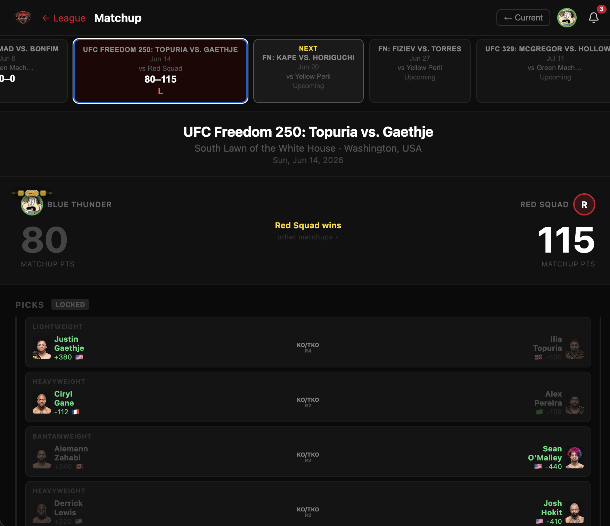

# Fantasy UFC

ESPN-style fantasy sports app for UFC. Build a league, predict fight outcomes, and compete head-to-head as real results roll in live.

**▶︎ Try it: [fantasyfightingleague.vercel.app](https://fantasyfightingleague.vercel.app)**



---

## Features

- 🥊 **Two league formats** — _Pick'em_ (predict winners & finish methods for points) and _Staking_ (bet a weekly budget with odds-based payouts)
- 📊 **Live scoring** — fight results pulled from ESPN in real time; scores update as the card unfolds
- ⚔️ **Head-to-head matchups** — your score faces a different league member every event
- 🏆 **Playoffs & a season champion** — plus a BMF belt that travels to whoever beats the current holder
- 📱 **Companion mobile app** — native iOS/Android build via Expo / React Native
- 🔔 **Leagues, done right** — invite codes, league chat, notifications, waivers, and commissioner tools

---

## How to Play

1. **Join a league** — create your own or join friends with an invite code.
2. **Make your picks** — each UFC event, pick the fight winners and how they'll win. (Staking leagues bet a weekly budget on fights instead.)
3. **Go head-to-head** — your score faces a different league member every event; most points takes the win.
4. **Win the season** — rack up wins, reach the playoffs, and claim the title.

---

## Stack

- **API** — Node.js / Express / TypeScript (`apps/api`)
- **Web** — React / Vite / TypeScript (`apps/web`)
- **Mobile** — Expo / React Native (`apps/mobile`)
- **Database** — Supabase (PostgreSQL)
- **Cache** — Redis (Upstash)
- **Shared types** — `packages/shared`

---

## Live deployment

| Service | URL                                                       |
| ------- | --------------------------------------------------------- |
| Web     | https://fantasyfightingleague.vercel.app                  |
| API     | https://fantasy-fighting-league-production.up.railway.app |

---

## Prerequisites

- Node.js 20+
- npm 10+
- A [Supabase](https://supabase.com) project (free tier works)
- Redis — local (`redis://localhost:6379`) or [Upstash](https://upstash.com) free tier

---

## Setup

### 1. Install dependencies

```bash
npm install
```

### 2. Configure environment variables

Copy the example file and fill in your values:

```bash
cp .env.example .env
```

You'll need:

- `SUPABASE_URL` — Supabase Dashboard → Project Settings → API
- `SUPABASE_ANON_KEY` — same page
- `SUPABASE_SERVICE_ROLE_KEY` — same page, service role key (keep secret)
- `DATABASE_URL` — Supabase Dashboard → Project Settings → Database → Connection String (Session mode, port 5432)
- `JWT_SECRET` — Supabase Dashboard → Project Settings → API → JWT Settings → JWT Secret
- `REDIS_URL` — `redis://localhost:6379` for local Redis, or your Upstash `rediss://` URL
- `PORT` — defaults to `3000`

### 3. Run the database migration

```bash
npm run db:migrate
```

### 4. Seed fighter and event data

```bash
npm run db:seed
```

### 5. (Optional) Seed a full 4-team test league

```bash
export $(grep -v '^#' .env | xargs)
npx tsx seed-full-league.ts
```

---

## Running locally

**Terminal 1 — API server**

```bash
npm run dev --workspace=apps/api
```

Env vars are loaded automatically from `apps/api/.env` via `--env-file`.

**Terminal 2 — Web app**

```bash
node_modules/.bin/vite apps/web
```

Then open [http://localhost:5173](http://localhost:5173).

> The API must be running before the web app will load data.

---

## Apps

| App    | Command                            | URL                   |
| ------ | ---------------------------------- | --------------------- |
| Web    | `node_modules/.bin/vite apps/web`  | http://localhost:5173 |
| API    | `npm run dev --workspace=apps/api` | http://localhost:3000 |
| Mobile | `cd apps/mobile && npx expo start` | Expo Go app           |

---

## Deployment

### Services needed

| What        | Provider                       | Notes                          |
| ----------- | ------------------------------ | ------------------------------ |
| API hosting | [Railway](https://railway.app) | Free tier                      |
| Web hosting | [Vercel](https://vercel.com)   | Free tier                      |
| Redis       | [Upstash](https://upstash.com) | Free tier, use `rediss://` URL |
| Database    | Supabase                       | Already cloud-hosted           |

### Deploy API (Railway)

```bash
npm install -g @railway/cli
railway login
railway init
railway up --detach
```

Set these environment variables in the Railway dashboard or via CLI:

```
SUPABASE_URL
SUPABASE_ANON_KEY
SUPABASE_SERVICE_ROLE_KEY
DATABASE_URL
JWT_SECRET
REDIS_URL        # Upstash rediss:// URL
NODE_ENV=production
PORT=3000
CORS_ORIGIN      # set after Vercel deploy (your *.vercel.app URL)
```

Railway will give you a public URL like `https://your-app.up.railway.app`.

### Deploy web (Vercel)

```bash
npm install -g vercel
vercel login
vercel env add VITE_API_URL production
# enter: https://your-railway-url.up.railway.app/api/v1
vercel --prod --yes
```

### Update CORS

Once you have the Vercel URL, set it in Railway:

```bash
railway variables set CORS_ORIGIN=https://your-app.vercel.app
railway up --detach
```

### Updating the app

Push to GitHub, then redeploy both services:

```bash
git push
railway up --detach   # redeploys the API (~2-3 min)
vercel --prod         # redeploys the web app (~1 min)
```

---

## Project structure

```
fantasy-ufc/
├── apps/
│   ├── api/        # Express REST API
│   ├── web/        # React/Vite web app
│   ├── mobile/     # Expo mobile app
│   └── desktop/    # Electron desktop app
├── packages/
│   └── shared/     # Shared TypeScript types and utilities
├── seed-full-league.ts   # Seeds a 4-team test league
└── test-scoring-pipeline.ts  # Validates live scoring pipeline
```
